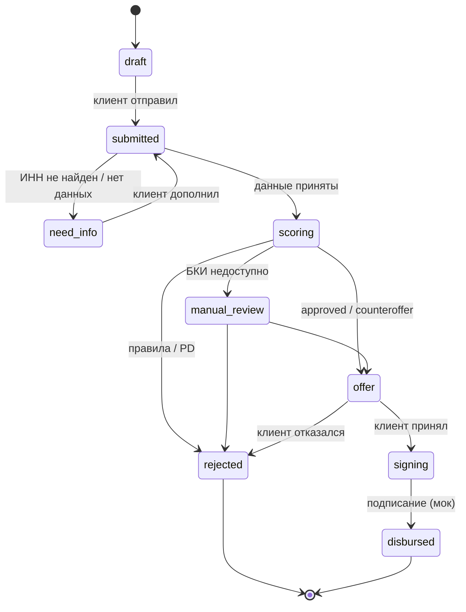

# Состояния заявки

```mermaid
stateDiagram-v2
    [*] --> draft
    draft --> submitted: клиент отправил
    submitted --> need_info: ИНН не найден / нет данных
    need_info --> submitted: клиент дополнил
    submitted --> scoring: данные приняты
    scoring --> manual_review: БКИ недоступно
    scoring --> rejected: правила / PD
    scoring --> offer: approved / counteroffer
    manual_review --> offer
    manual_review --> rejected
    offer --> signing: клиент принял
    offer --> rejected: клиент отказался
    signing --> disbursed: подписание (мок)
    rejected --> [*]
    disbursed --> [*]
```
Сервис в этом репозитории реализует переходы `scoring → {offer, rejected, manual_review, need_info}`; остальные состояния — на стороне бэкенда кабинета.
